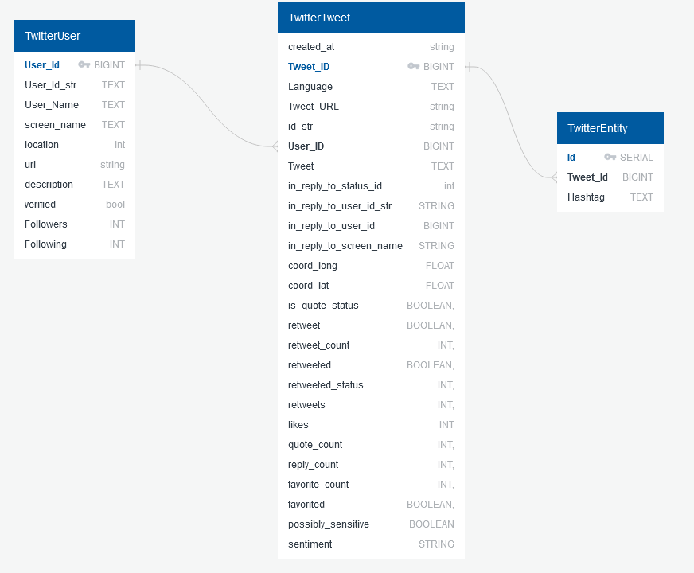

# Twitter COVID-19 Sentiment Analysis
Group Project: Module 20 

#### Members:
Christopher Bach (Pentagon)
Khalid Hamid Fallous (Hexagon)
Jay Hirpara (Septagon)
Jing Tang (X)
Graham Thomas (Square)
David Wetherhold (Circle)

#### Overview
This project seeks to build a correlation analysis between twitter sentiment and hospitalization rates.  The purpose is to broadly understand the effects of sentiment towards the vaccine on realized health implications.

Our data sources are directly from Twitter, via the widely published Twitter API, tweepy, as well as several datasets
sourced from Kaggle.

#### Project Goal:

This project aims to collect some data and perform sentiment analysis surrounding trending topics related to covid-19 and covid-19 vaccines. We will perform the ETL using python and a SQL database, and also come up with some machine learning algorithms to predict trending topics and hashtags related to the virus and it's vaccines.  The project will bring some meaningful discussions over whether getting vaccinated stands in the way of individual personal liberty, including but not limited to the topic of employers requirement to have staff vaccinated.

Our goal: Using Twitter to research Vaccination sentiment (by region), cross correlating with hospitalization rates.

Reason:
We've selected this topic because it is extraordinarily topical, using technologies that are very relevant to the world today. 

#### Data Source description:
We're using Twitter api data as the source of sentiment analysis data.
We intend to use CDC, or other data as the source of hospitalization rate data.

We attempted to retrieve historical Twitter api data and parse the JSON request results into what we need, which we have presented in the repo as testing scripts, however, with the limited access of academic use purposes, time and skillsets, instead we decided to switch to some existing Kaggle datasets of covid vaccination tweets. 

https://www.kaggle.com/gpreda/all-covid19-vaccines-tweets/activity

https://www.kaggle.com/maxjon/complete-tweet-sentiment-extraction-data/activity

#### Questions We Want Answered:

1. to understand the relationship between sentiment, as measured by twitter, and hospitalization rates.

Communication Protocols:
- The group meets each Monday and Wednesday evening.
- All other collaboration, including idea sharing, progress updates, coding updates, and meeting arrangements, are made through Slack.

#### DataTools: 
1. Python 3.7 libraries: Twython, Tweety library, sklearn
2. Anaconda, Jupyter Notebook
3. SQL (PostGres)
4. Tableau 

#### Deliverable 2 Outline:

##### Machine Learning Model

##### Database Integration

[Fig1: Updated Database Structure](02.Database/UpdatedDBStructure.png?raw=true "Fig1: Updated Database Structure")

An Amazon RDS instance is created at:
covidsentiment.cqciwtn1qpki.us-east-2.rds.amazonaws.com

and can be accessed with a password upon request.

This database is initially loaded with a dataset of 60k tweets collected over an 8 week period from December 1 2019 to Jan 28 2020 from:

https://www.trackmyhashtag.com/blog/free-twitter-datasets/

##### Dashboard

# ETL Notes
### Extract-Transform-Load
--- 
First, design an Entity Relationship Diagram (ERD) as a visual aid, prior to creating Tables in PostgreSQL. (see below)

  
  
  
 -    tweepy: Python library for accessing the Twitter API
 -   SkLearn: popular machine learning library
 -    NLTK: Natural language processing library
 -   re: regular expression library
 -   pandas: popular data analysis library
  
  
  
We're tasked with priming raw data from JSON files via Twitter's API.\
Nevertheless, we'll consider the following questions before any unsupervised learning models can be applied and results analyzed. 

   -  Will I be able to easily hand off this data set to other teams?
   -  Does the data contain excess data that we don’t really need?
   -  How can I get this data to be used to create great visualizations?

