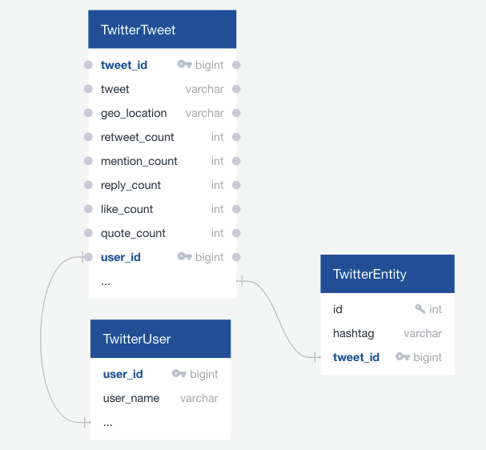

# Twitter COVID-19 Sentiment Analysis
Group Project: Module 20 

#### Members:
Christopher Bach (Pentagon)
Khalid Hamid Fallous (Hexagon)
Jay Hirpara (Septagon)
Jing Tang (X)
Graham Thomas (Square)
David Wetherhold (Circle)

#### Overview
This project seeks to draw a correlary analysis between twitter sentiment by geography 
and hospitalization rate.  The purpose is to broadly understand the effects of the vaccine 
on realized health implications.

Our data source is directly from Twitter, via the widely published Twitter API, tweepy.

#### Project Goal:

This project aims to collect some data and perform sentiment analysis surrounding trending topics related to covid-19 and covid-19 vaccines. We will perform the ETL using python and a SQL database, and also come up with some machine learning algorithms to predict trending topics and hashtags related to the virus and it's vaccines.  The project will bring some meaningful discussions over whether getting vaccinated stands in the way of individual personal liberty, including but not limited to the topic of employers requirement to have staff vaccinated.

Our goal: Using Twitter to research Vaccination sentiment (by region), cross correlating with hospitalization rates.

Reason:
We've selected this topic because it is extraordinarily topical, using technologies that are very relevant to the world today. 

#### Data Source description:
We're using Twitter api data as the source of sentiment analysis data.
We intend to use CDC, or other data as the source of hospitalization rate data.

#### Questions We Want Answered:

1. to understand the relationship between sentiment, as measured by twitter, and hospitalization rates.

Communication Protocols:
- All parts of collaboration, including idea sharing, progress updates, coding updates, and meeting arrangements, are made through Slack.

#### DataTools: 
1. Python 3.7 libraries: Twython, Tweety library, sklearn
2. Anaconda, Jupyter Notebook
3. SQL (PostGres)
4. Tableau 

#### Deliverable 1 Overview:

At this stage, we're still working out the format of the data that will feed out of the Twitter (Tweety) pipeline.
We have a provisional database as:

[Fig1: Preliminary DB Structure](02.Database/PreliminaryDBStructure.png?raw=true "Fig1: Preliminary DB Structure")
Within the 02.Database folder is also a jupyter notebook which can be used to create the tables in PostGres.

We anticipate having a sentiment analysis engine (preliminarily in the 01.Twitter_API_Testing folder), which will score tweets as positive, negative, or neutral.  Thus, the sample data in 03.Machine_Learning is a  .csv file with three possibilities.  We use this sample data to load into the two jupyter notebooks in the same folder.

Summary
